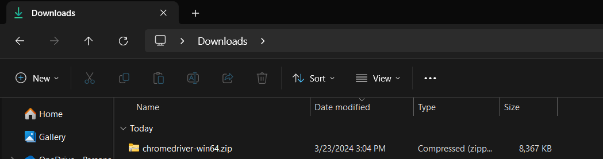
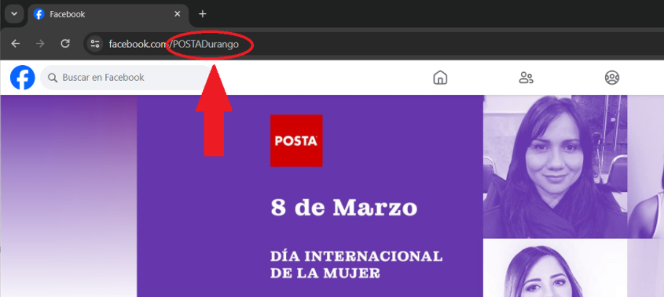

# POSTA-AI
Machine learning project that identifies tendencies for a Durango (Mexico) local news company

# Read first before anything else
######In order to get the whole code to work, you need to install 'requirements.txt' file, these are the dependencies needed for your python environment.

`python3 -m venv env` ---> Creates a new python virtual environment
`source env/scripts/activate` ---> Activates the recently created virtual environment (command may vary from windows, mac and linux or your specific file system)
`pip install -r requirements.txt` ---> Gets all the dependencies needed for this project

###Chrome driver installation:
This project uses selenium to work, which is a automated testing tool for chrome, chromedriver updates relatively often, you need to update it and add it to your path environment variable:

Download chromedriver at: https://googlechromelabs.github.io/chrome-for-testing/#stable

(latest stable version you can find)

save it anywhere you want:

###Data collecting module:

This module consists of 3 specific files: facebook_scraper.py, instagram_scraper.py and tiktok_scraper.py

To get each to work, simply run via command line:

##Facebook:
`py facebook_scraper.py`

You'll be asked to prompt the facebook page subdomain:
`$Introduce the website to be scraped: `
Enter the facebook subdomain (facebook page) you want to scrape:

then you'll be asked for the name of your document (csv) where your scraped data will be stored:

`$Name your csv file: `

Make sure to just write the name, the file type is .csv by default

